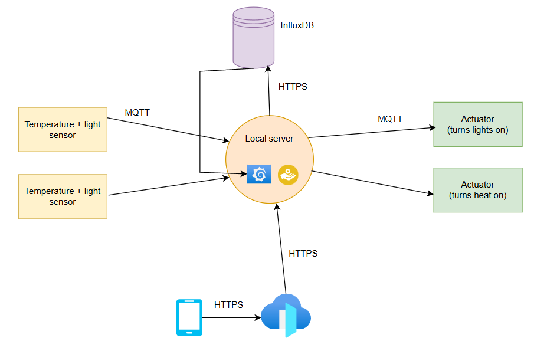
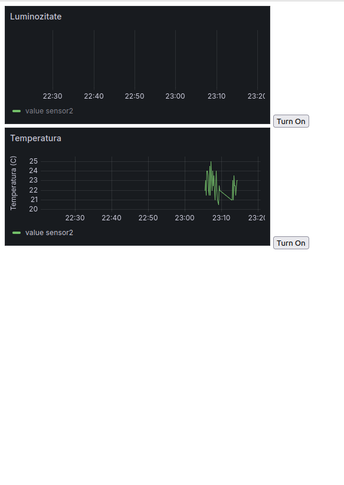
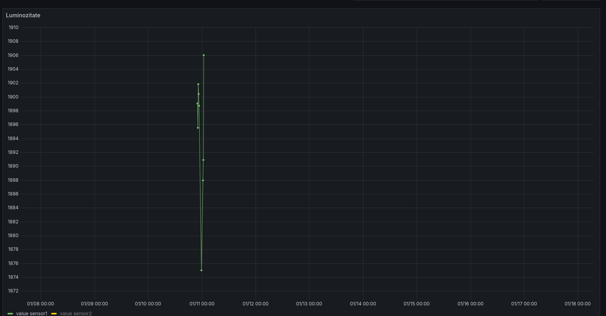
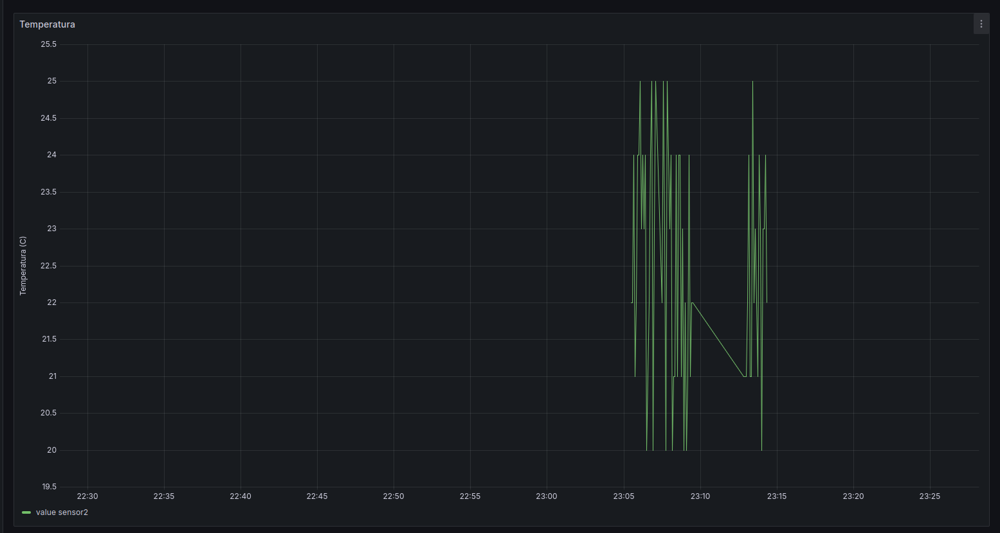

# Proiect - Sera de flori

## Introducere
### Descriere proiect
Proiectul presupune un sistem de monitorizare a calitatii ambientale intr-un solar de flori/plante in care sunt monitorizati factori precum intensitatea luminoasa si temperatura aerului. Ca si actuatori avem niste switch-uri care vor porni sistemul de incalzire sau vor aprinde lumini, in functie de comenzile primite.

## Arhitectura
### Diagrama componente

### Protocoale folosite:
- Pentru comunicarea senzorilor si a actuatorilor va fi folosit protocolul `MQTT`, iar un `server local`(in cazul nostru un laptop va fi mai mult decat suficient) va avea pe de o parte rol de `MQTT broker`.
- Totodata, un `alt proces` de pe serverul central va fi la randul lui un `SUBSCRIBER` pentru informatiile primite de la senzori, pe care le va pasa mai departe la instanta locala de `vizualizare a datelor`(Grafana/Chart.js).
- Pentru a putea avea conectivitate de pe orice device din afara retelei locale, voi folosi Ngrok pe post de front-door, care creaza un tunel criptat intre serverul local si serverul lor, oferind un endpoint pe care il pot accesa de oriunde.

### Certificate TLS
- Pentru toate serviciile create pe localhost am creat certificate TLS semnate local.

### Implementare
- Pentru aplicatia de mobil am creat o pagina statica de HTML, care afiseaza 2 grafice generate de grafana in timp real cu evolutia datelor monitorizate. Langa aceste grafice exista 2 butoane de Turn on/off pentru fiecare valoare monitorizata, in cazul in care se doreste sa se opreasca senzorii din monitorizare.

- In momentul in care se apasa pe butonul de on/off se va face o cerere catre API serverul care ruleaza `flusk` si expune niste endpoint-uri de baza. Cand serverul API primeste o cerere de `/temperature/on` de exemplu, va trimite catre broker un mesaj pe topicul `controlPlane/temperature` cu payload-ul `{"value": "on"}`
- 

- Brokerul de `MQTT` folosit este `eclipse-mosquitto`. La acesta se aboneaza si senzorii pe topicurile `controlPlane/temperature` si `controlPlane/light`, iar cand primesc un mesaj pe aceste topic-uri vor actiona in concordanta - de a se opri/ a incepe sa transmita date citite de pe senzori.

- Un alt proces de pe serverul central se va abona la toate topicurile care trimit date de la senzori precum `greenhouse/temperature` si `greenhouse/light`, iar in momentul in care va primi un mesaj pe aceste topic-uri (trimise de senzori), el le va trimite mai departe catre baza de date.

- Grafana construieste graficele pe baza datelor primite din influxdb in mod constant, unde sunt incarcate de catre serverul central.

### Grafice

### Repository
https://github.com/FlaviusMazilu/PR-IoT-Greenhouse-Monitoring
